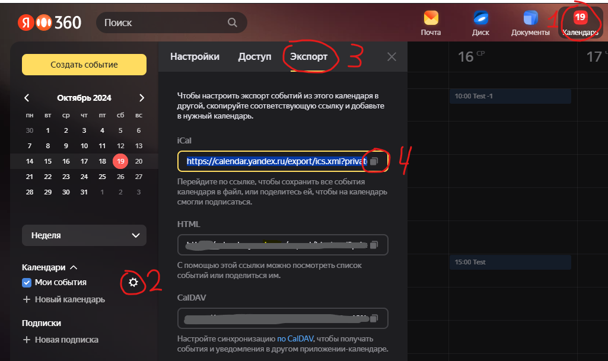

```
    ____  ______      __               __                    
   / __ \/ ____/___ _/ /__  ____  ____/ /___ ______          
  / / / / /   / __ `/ / _ \/ __ \/ __  / __ `/ ___/          
 / /_/ / /___/ /_/ / /  __/ / / / /_/ / /_/ / /              
/_____/\____/\__,_/_/\___/_/ /_/\__,_/\__,_/_/               
    _   __      __  _ _____            __  _                 
   / | / /___  / /_(_) __(_)________ _/ /_(_)___  ____  _____
  /  |/ / __ \/ __/ / /_/ / ___/ __ `/ __/ / __ \/ __ \/ ___/
 / /|  / /_/ / /_/ / __/ / /__/ /_/ / /_/ / /_/ / / / (__  ) 
/_/ |_/\____/\__/_/_/ /_/\___/\__,_/\__/_/\____/_/ /_/____/   v1.1
```

# DCalendarNotifications

***DCalendarNotifications*** - приложение, выдающее уведомления о событиях из Яндекс.Календаря.

# Технологии

- Основа проекта - `.Net Core 6.0` и `Windows Forms`
- Библиотека для работы с каледнарем - `Ical.Net`
- ASCII-шрифт в заголовке данного файла - `Slant`

# Конфигурация

Конфигурирование приложения происходит путем модификации файла Config.xml, который при сборке приложения копируется в результирующую папку.

Основной тег конфигурации `Config` является обязательным и содержит следующие теги:
- `Source` - ссылка на источник ICal данных;
- `Timers`  - отвечает за настройку таймеров:
  - Артибут `UpdateInterval` содержит интервал таймера обновления данных в секундах;
  - Артибут `ReminderInterval` содержит интервал таймера выдачи уведомлений в секундах;
- `NotificationTimeOffsetsList` - отвечает за настройку временных сдвигов для отображения уведомлений:
  - `TimeOffset` - конфигурирует единичную выдачу уведомления с указанным временным сдвигом;
    - Артибут `Hours` содержит временной отступ в часах;
    - Артибут `Minutes` содержит временной отступ в минутах;
    - Артибут `Seconds` содержит временной отступ в секундах;

# Пример конфигурации

При использовании стандартного файла конфигурации:

```xml
<?xml version="1.0" encoding="utf-8" ?>
<Config>
    <Source>https://calendar.yandex.ru/export/ics.xml?private_token=some_token&tz_id=your_place</Source>

    <Timers UpdateInterval="3600" ReminderInterval="60" />

    <NotificationTimeOffsetsList>
        <TimeOffset Hours="0" Minutes="-15" Seconds="0" />
        <TimeOffset Hours="0" Minutes="-5" Seconds="0" />
        <TimeOffset Hours="0" Minutes="0" Seconds="0" />
    </NotificationTimeOffsetsList>
</Config>
```

Приложение сработает следующим образом:

- Данные будут извлекаться по ссылке https://calendar.yandex.ru/export/ics.xml?private_token=some_token&tz_id=your_place (значение из тега `Source`);
- После запуска приложение обновит данные и проверит, нужно ли выдать уведомления немедленно;
- Приложение будет обновлять данные каждый час (раз в 3600 секунд, значение из атрибута `UpdateInterval` тега `Timers`);
- Приложение будет проверять, нужно ли выдавать уведосление каждую минуту (раз в 60 секунд, значение из атрибута `ReminderInterval` тега `Timers`);
- Для каждого события будет выдано 3 (три) уведомления:
    - Ровно в момент начала события (из тега `<TimeOffset Hours="0" Minutes="0" Seconds="0" />`)
    - За 5 (пять) минут до начала события (из тега `<TimeOffset Hours="0" Minutes="-5" Seconds="0" />`)
    - За 15 (пятнадцать) минут до начала события (из тега `<TimeOffset Hours="0" Minutes="-15" Seconds="0" />`)

# Где брать ссылку для тега `Source`

1. Открыть `Яндекс.Календарь`
2. Открыть настройки выбранного календаря
3. Открыть вкладку `Экспорт`
4. Скопировать ссылку `iCal`



Xml не умеет обрабатываеть символ "`&`", поэтому они программно будут заменены на "`&amp;`". Вручную этого делать ***НЕ НУЖНО***!